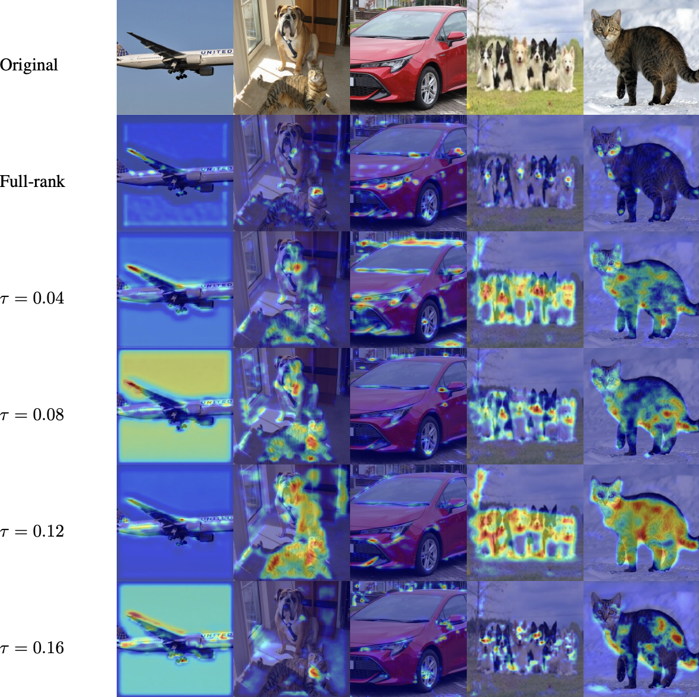
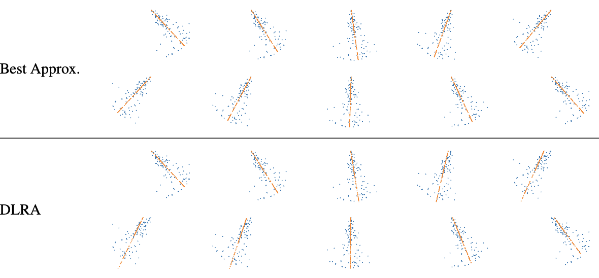

# Pytorch implementation of "Dynamical Low-rank approximations and its application to neural interpretability"


## Installation

1. create a python virtual environment (pyenv or conda) and install pip using  ``conda install pip``. If you are using no virtual environment, please be aware of
   version incompatibilities of tensorflow.
2. Install the project requirements (example for pip):
   ``pip install -r requirements.txt``.

## Usage: Low-rank neural networks
1. In this repository there are different datasets folders, inside each one of them there are the Python scripts to train on some neural networks. The files are named as ``netname_datasetname.py`` (for DLRT) and ``netname_datasetname_baseline.py`` for the full rank standard Pytorch baseline. Each script contains its parsers to modify the training parameters (the help for the parsers is available). Results are saved in the relative folder inside the current one.
2. All the other folders (e.g. accuracy_vs_cr,UV_vanilla,Lenet_experiment,timings) contain the experiment presented in the thesis to be run. 
3. Each folder contains a produce_results file, that is producing the table or the plots presented in the paper.


## Usage: GradCAM
1. The GradCAM implementation is based on the repository of Jacob Gildenblat, and resides in `/pytorch-grad-cam/`. The only difference is that we added the possibility to use the low-rank approximation of the weights, reflected in the entry point ``cam.py``.
2. The shell script `run.sh` can be used to run both the full rank and low-rank GradCAM on your own test images within `/test_images/`.
3. An important change is the `targets` variable within `cam.py`. This can be set to `None` to use the predicted class, or a list of lists of `ClassifierOutputTarget` to use the classes you choose. Best is to use the ground truth labels of the images you are using.

## Usage: Dynamical PCA
1. The code to setup the pendulum environment and run the dynamical PCA is entirely contained in `pca_experiments.ipynb`.
2. Simply run the notebook and follow the instructions. Figures will be saved in the `figures` folder, and some gifs will be saved in the current folder.


### Citations

This repository is largely based on two papers:

1. Low-rank lottery tickets: finding efficient low-rank neural networks via matrix differential equations
```
@inproceedings{schotthofer2022lowranklottery,
 author = {Schotth\"{o}fer, Steffen and Zangrando, Emanuele and Kusch, Jonas and Ceruti, Gianluca and Tudisco, Francesco},
 booktitle = {Advances in Neural Information Processing Systems},
 editor = {S. Koyejo and S. Mohamed and A. Agarwal and D. Belgrave and K. Cho and A. Oh},
 pages = {20051--20063},
 publisher = {Curran Associates, Inc.},
 title = {Low-rank lottery tickets: finding efficient low-rank neural networks via matrix differential equations},
 url = {https://proceedings.neurips.cc/paper_files/paper/2022/file/7e98b00eeafcdaeb0c5661fb9355be3a-Paper-Conference.pdf},
 volume = {35},
 year = {2022}
}
```
2. Dynamical Low-rank Approximation
```

@article{koch2007dynamicallrapprox,
author = { Koch, Othmar and  Lubich, Christian},
title = {Dynamical Low‐Rank Approximation},
journal = {SIAM Journal on Matrix Analysis and Applications},
volume = {29},
number = {2},
pages = {434-454},
year = {2007},
doi = {10.1137/050639703},
URL = {https://doi.org/10.1137/050639703},
}
```
Moreover, the GradCAM experiments are based on the repository of Jacob Gildenblat:
```
@misc{jacobgilpytorchcam,
  title={PyTorch library for CAM methods},
  author={Jacob Gildenblat and contributors},
  year={2021},
  publisher={GitHub},
  howpublished={\url{https://github.com/jacobgil/pytorch-grad-cam}},
}
```

